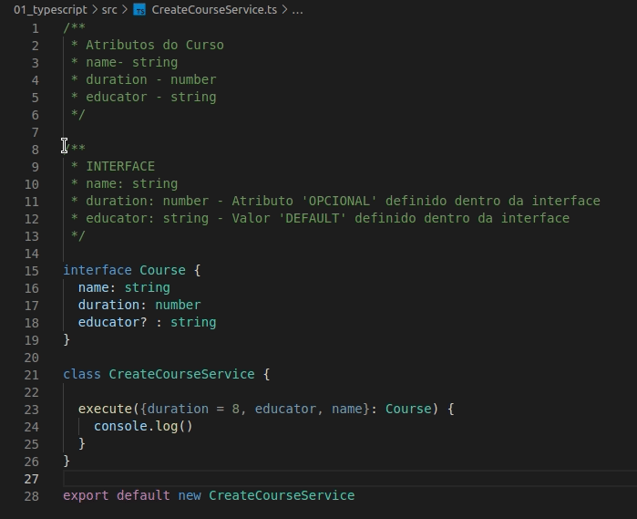

# Configuração de Projeto com TypeScript

## Configurações Gerais

  * Instalação de bibliotecas 
    ```bash 
      npm i typescript -D
    ```
  
  * Instalação a dependdência do TypeScript
  
    ```bash 
      npm i typescript -D
    ```

  * Configuração do TypeScript
    ```bash 
      npx tsc --init  
    ```

      Obs: o comando acima cria o arquivo de configurção *tsconfig.json*

  * Instalação das tipagens das bibliotecatas 
    
    ```bash 
      @types/nome_biblioteca
    ```
  
## Sobre Interface

  

  * Criar uma interface
  * Atribuir o valor do atributo como opcional/obrigatório
  * Definição de valor por "Default"
  * Usar a interface