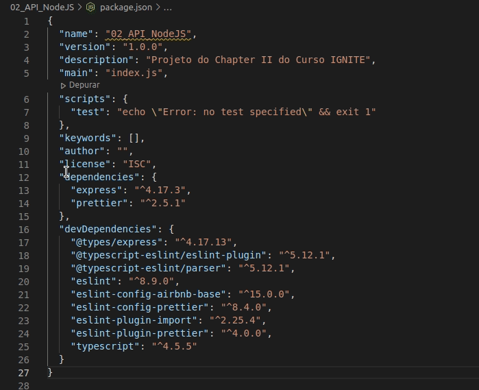

# CRIANDO API COM NODEJS

## Configurações Gerais - Bibliotecas

  * Instalação de bibliotecas 
  * 
    ```bash 
      npm i nome_biblioteca
      npm i @types/nome_biblioteca -D
    ```
  * Instalação do ts-node-dev
  * Configurar Script *dev* para executar a aplicação
    * --transpile-only - 
    * --ignore-watch node_modules - Ignorar atualização do node_modules
    * -- respawn - sempra dar roload
    
## Sobre Models

  

  * Criar uma Model
  * Atribuir o valor do atributo como opcional/obrigatório
  * Definição de valor por "Default

## Repositórios

  * Manipulação de dados da aplicação
  
## Model

  * Modelagem de dados da aplicação
  